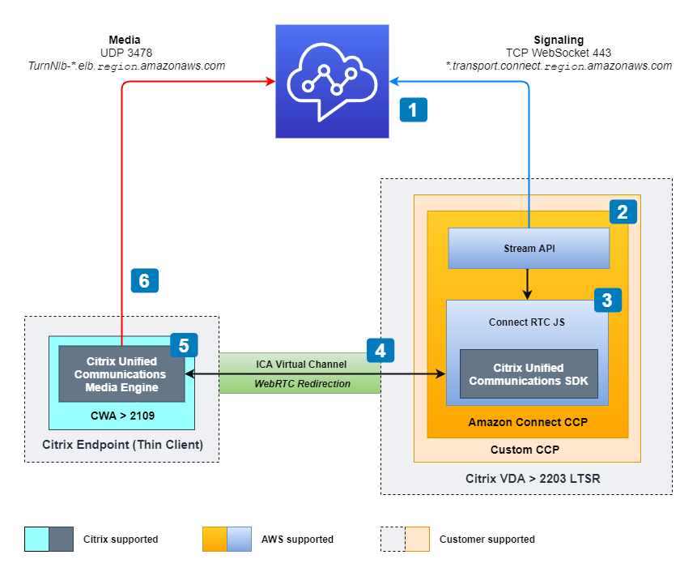

# Amazon Connect Audio Optimization for Citrix - Custom CCP

## Background
Integrating Amazon Connect, an [omnichannel](https://docs.aws.amazon.com/connect/latest/adminguide/amazon-connect-glossary.html#omnichannel-def) cloud contact center solution from AWS, with Citrix's virtualization technology poses unique challenges, particularly in audio quality during customer interactions. This project addresses these challenges, enabling seamless and high-quality audio communication in Citrix environments with a Custom CCP that utilizes the [Amazon Connect - Connect RTC JS](https://github.com/aws/connect-rtc-js) and [Amazon Connect - Streams API](https://github.com/amazon-connect/amazon-connect-streams) to enhance audio quality for contact centers agents using Citrix Workspaces. 

## Pre-requisites
* Citrix Virtual Desktops and Apps (VDA) service that needs to be version 2203 LTSR or above.
* Citrix Workspace Application (CWA) installed on your local machine that is version 2109 or above for Windows, Linux & Mac.

## Installation
```shell
$ git clone https://github.com/aws-samples/amazon-connect-audio-optimization.git
$ cd Citrix/Custom CCP
$ npm install -g aws-cdk
$ npm install
```

## Configuration
Update the following values in initCCP.js in the `/src/scripts/` folder
1. connectCCPUrl
   1. ex. https://`instance_alias`.my.connect.aws/ccp-v2/
2. connectRegion
   1. ex. `us-east-1`, `us-west-2`, `eu-central-1`, `eu-west-2`
   2. NOTE: Full list of available Amazon Connect Regions: https://docs.aws.amazon.com/connect/latest/adminguide/regions.html

## Deployment

**Pre-Requisites:**
If you haven't deployed a CDK project on your AWS Account, you will need to run the following command to initialize your AWS environment.
```shell
$ cdk bootstrap
```

Move to the CDK folder and deploy.
```shell
$ cd cdk
$ cdk deploy
```

## Useful commands
* `npm run start`   run locally on your dev machine
* `npx cdk diff`    compare deployed stack with current state
* `npx cdk synth`   emits the synthesized CloudFormation template
* `npx cdk deploy`  deploy this stack to your default AWS account/region

## Visuals


1.	Call originates in Amazon Connect
2.	Amazon Connect notifies the custom CCP of the call
3.	CCP uses Connect RTC.js that embeds the Citrix Unified Communications (UC) SDK
4.	Citrix UC SDK communicates with Citrix UC Media Engine
5.	Citrix UC Media Engine establishes connection with Amazon Connect
6.	Telephony media traverses from local host machine to Amazon Connect

## License
Copyright 2024 Amazon.com, Inc. or its affiliates. All Rights Reserved.
SPDX-License-Identifier: MIT-0